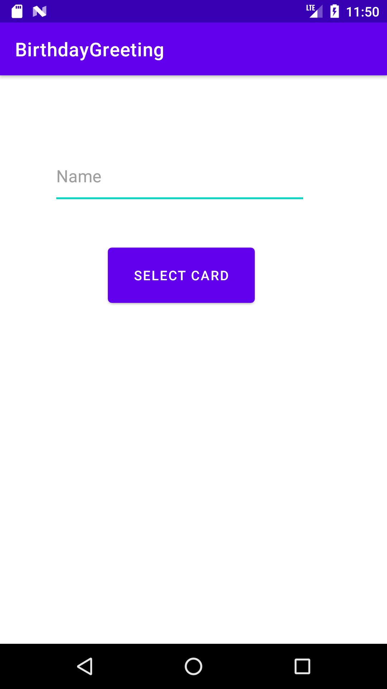

# BirthdayGreeting
You can create birthday card by entering the name and selecting the card by your choice.

############### App Information #####################################
In this app, i have used Grid layout using recycler view to show the card.

# Screenshots

  
  

  
  

